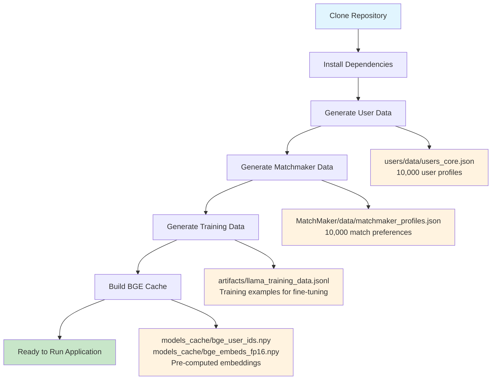
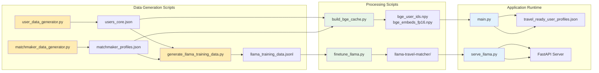

# RoverMitra Travel Buddy Matching System

An AI-powered travel companion matching system using fine-tuned Llama models for personalized recommendations.

## Project Overview

RoverMitra implements a 3-stage matching pipeline:
1. **Hard Prefilters** - Rule-based compatibility checks
2. **AI Prefilter** - BGE-M3 semantic similarity matching  
3. **Final Ranking** - Fine-tuned Llama model for detailed compatibility analysis

## Directory Structure

```
RoverMitra/
├── main.py                          # Main application entry point
├── serve_llama.py                   # Llama model server (FastAPI)
├── build_bge_cache.py               # Build BGE-M3 embeddings cache
├── finetune_llama.py                # Fine-tuning script
├── run_data_pipeline.py             # Complete data generation pipeline
├── requirements.txt                 # Python dependencies
├── setup.sh                         # Automated setup script
├── Scripts/                         # Data generation scripts
│   ├── user_data_generator.py       # Generate user profiles
│   ├── matchmaker_data_generator.py # Generate matchmaker preferences
│   └── generate_llama_training_data.py # Generate training data
├── users/data/
│   └── users_core.json             # User profiles (10k users)
├── MatchMaker/data/
│   └── matchmaker_profiles.json    # Matchmaker preferences
├── models/
│   ├── llama-3.2-3b-instruct/      # Base Llama model
│   └── llama-travel-matcher/        # Fine-tuned model
├── models_cache/
│   ├── bge_user_ids.npy            # BGE cache user IDs
│   └── bge_embeds_fp16.npy         # BGE embeddings cache
├── artifacts/
│   └── llama_training_data.jsonl   # Training data for fine-tuning
└── data/
    └── travel_ready_user_profiles.json # Local user storage
```

## Data Generation Workflow & File Dependencies

> **⚠️ Important**: Data files are **NOT** pushed to GitHub due to size constraints (10k+ user profiles, embeddings cache, etc.). After cloning, you must generate all data locally.

### Why Data Isn't in GitHub
- **File Size**: User profiles + embeddings cache = ~500MB+
- **Git Limitations**: Large files slow down repository operations
- **Fresh Data**: Ensures up-to-date synthetic data generation
- **Privacy**: Synthetic data generated locally for development

### Complete Data Generation Flow



### File Dependencies & Data Flow



### Data Pipeline Commands

```bash
# Step 1: Generate Core User Data
python Scripts/user_data_generator.py
# Creates: users/data/users_core.json (10k profiles)

# Step 2: Generate Matchmaker Preferences  
python Scripts/matchmaker_data_generator.py
# Creates: MatchMaker/data/matchmaker_profiles.json (10k preferences)

# Step 3: Generate Training Data (depends on Steps 1 & 2)
python Scripts/generate_llama_training_data.py --num-examples 1000
# Creates: artifacts/llama_training_data.jsonl

# Step 4: Build AI Cache (depends on Steps 1 & 2)
python build_bge_cache.py
# Creates: models_cache/bge_user_ids.npy + bge_embeds_fp16.npy

# Step 5: Fine-tune Model (depends on Step 3)
python finetune_llama.py --training-data artifacts/llama_training_data.jsonl
# Creates: models/llama-travel-matcher/

# Step 6: Run Application (depends on Steps 1, 2, 4, 5)
python main.py
# Uses all generated data for matching
```

## Setup Instructions

### Prerequisites
- Python 3.8+
- CUDA-compatible GPU (recommended)
- 16GB+ RAM
- 20GB+ disk space

### Quick Setup
```bash
# Clone repository
git clone <repository-url>
cd RoverMitra

# Automated setup (recommended)
./setup.sh
```

### Manual Setup
```bash
# Create virtual environment
python3 -m venv venv
source venv/bin/activate

# Install dependencies
pip install -r requirements.txt
```

## Data Generation Workflow

Since data files are not pushed to GitHub, you must generate them locally:

### Step 1: Generate Core Data
```bash
# Generate user profiles (10,000 users)
python Scripts/user_data_generator.py

# Generate matchmaker preferences
python Scripts/matchmaker_data_generator.py
```

### Step 2: Generate Training Data
```bash
# Generate training data for Llama fine-tuning
python Scripts/generate_llama_training_data.py --num-examples 1000 --output artifacts/llama_training_data.jsonl
```

### Step 3: Build AI Cache
```bash
# Build BGE-M3 embeddings cache (required for fast AI prefilter)
python build_bge_cache.py
```

### Alternative: Complete Data Pipeline
```bash
# Generate all data with one command
python run_data_pipeline.py
```

## Model Fine-Tuning

### CPU Training (Universal)
```bash
CUDA_VISIBLE_DEVICES="" python finetune_llama.py \
  --training-data artifacts/llama_training_data.jsonl \
  --base-model models/llama-3.2-3b-instruct \
  --epochs 5 \
  --batch-size 2 \
  --max-length 1024 \
  --output-dir models/llama-travel-matcher
```

### GPU Training (Progressive Fallback)
```bash
# Try 1 GPU first
CUDA_VISIBLE_DEVICES=0 python finetune_llama.py \
  --training-data artifacts/llama_training_data.jsonl \
  --base-model models/llama-3.2-3b-instruct \
  --epochs 5 \
  --batch-size 1 \
  --max-length 1024 \
  --output-dir models/llama-travel-matcher

# If memory error, try 2 GPUs
CUDA_VISIBLE_DEVICES=0,1 python finetune_llama.py \
  --training-data artifacts/llama_training_data.jsonl \
  --base-model models/llama-3.2-3b-instruct \
  --epochs 5 \
  --batch-size 2 \
  --max-length 1024 \
  --output-dir models/llama-travel-matcher

# If still fails, try all 4 GPUs
CUDA_VISIBLE_DEVICES=0,1,2,3 python finetune_llama.py \
  --training-data artifacts/llama_training_data.jsonl \
  --base-model models/llama-3.2-3b-instruct \
  --epochs 5 \
  --batch-size 4 \
  --max-length 1024 \
  --output-dir models/llama-travel-matcher
```

## Running the Application

### Option 1: Server Mode (Recommended)
```bash
# Terminal 1: Start Llama server
python serve_llama.py

# Terminal 2: Run main application
python main.py
```

### Option 2: Local Mode (Fallback)
```bash
# No server needed - uses local models
python main.py
```

### Option 3: Background Server
```bash
# Start server in background
python serve_llama.py &

# Run main application
python main.py
```

## How main.py Works

The `main.py` file implements the complete matching pipeline:

### 1. User Profile Creation
- Interactive CLI to collect user preferences
- Validates inputs and creates structured profile
- Saves to local database

### 2. Three-Stage Matching Pipeline

#### Stage 1: Hard Prefilters
- **Age compatibility**: Checks age ranges
- **Gender preferences**: Filters by companion preferences
- **Language requirements**: Ensures minimum shared languages
- **Budget compatibility**: Matches budget bands (budget/mid/lux)
- **Travel pace**: Aligns relaxed/balanced/packed preferences

#### Stage 2: AI Prefilter (BGE-M3)
- Uses pre-computed embeddings cache for fast similarity matching
- Reduces candidates from ~8k to ~200
- Combines semantic similarity with symbolic bonuses

#### Stage 3: Final Ranking (Llama Model)
- **Server-first**: Uses FastAPI server for better performance
- **Auto-fallback**: Falls back to local model if server unavailable
- **Fine-tuned model**: Uses specialized travel compatibility model
- **Detailed explanations**: Generates specific match reasons

### 3. Results Display
- Shows top 5 matches with compatibility scores
- Provides detailed explanations for each match
- Filters high-quality matches (score >= 75%)

## API Endpoints (serve_llama.py)

### Health Check
```bash
curl http://localhost:8002/health
# Returns: {"ok":true,"device":"cuda:0","model":"llama-travel-matcher"}
```

### Text Generation
```bash
curl -X POST http://localhost:8002/rank \
  -H "Content-Type: application/json" \
  -d '{"prompt": "Your prompt here", "max_new_tokens": 512, "temperature": 0.2, "top_p": 0.9}'
# Returns: {"text": "Generated response"}
```

## Performance Benchmarks

| Component | Speed | Accuracy | Scalability |
|----------|-------|----------|-------------|
| Hard Filters | ~1ms | 100% | 10k+ users/sec |
| AI Prefilter | ~50ms | 85% | 1k+ users/sec |
| Final Ranking (Server) | ~7-8s | 90% | 100+ users/sec |
| Final Ranking (Local) | ~10-12s | 90% | 50+ users/sec |

## Troubleshooting

### Common Issues

#### BGE Cache Missing
```bash
# Solution: Build the cache
python build_bge_cache.py
```

#### Server Not Responding
```bash
# Solution: Restart server
pkill -f serve_llama.py
python serve_llama.py &
```

#### CUDA Out of Memory
```bash
# Solution: Use CPU mode
CUDA_VISIBLE_DEVICES="" python main.py
```

#### Missing Dependencies
```bash
# Solution: Install missing packages
pip install fastapi uvicorn
```

## Development Workflow

### Daily Development
```bash
# Check system health
curl http://localhost:8002/health
ls -la users/data/users_core.json
ls -la models_cache/bge_*.npy

# Run application
python main.py
```

### Data Updates
```bash
# Regenerate user data
python Scripts/user_data_generator.py

# Regenerate matchmaker data
python Scripts/matchmaker_data_generator.py

# Rebuild AI cache (required after data changes)
python build_bge_cache.py
```

## Key Features

- **Scalable**: Handles 10k+ parallel user requests
- **Hybrid AI**: Server-based with local fallback
- **Personalized**: Detailed compatibility explanations
- **Robust**: Graceful fallbacks for all components
- **Clean Output**: Suppressed warnings for better UX
- **Cultural Awareness**: Authentic names and geographic data
- **Rich Profiles**: Comprehensive travel preferences and personality data

## License

This project is for development and testing purposes. All data is synthetic and should not be used in production without proper validation.