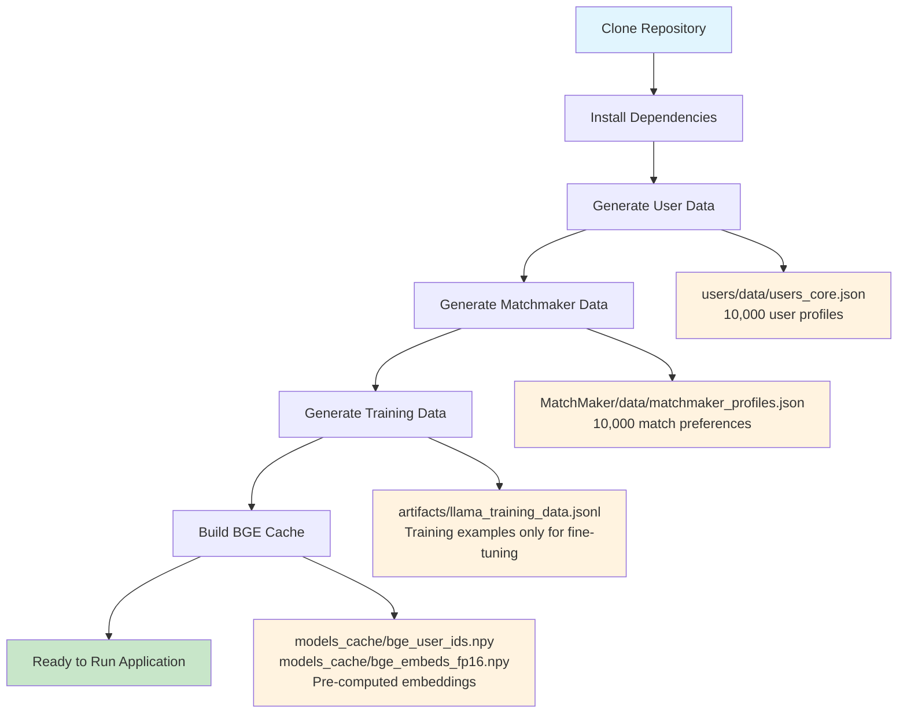
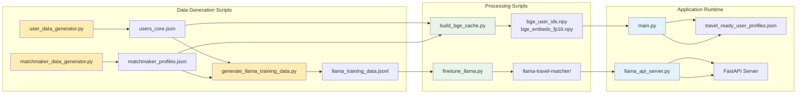

# RoverMitra Travel Buddy Matching System

An AI-powered travel companion matching system using fine-tuned Llama models for personalized recommendations.

## Project Overview

RoverMitra implements a 3-stage matching pipeline:
1. **Hard Prefilters** - Rule-based compatibility checks
2. **AI Prefilter** - BGE-M3 semantic similarity matching  
3. **Final Ranking** - Fine-tuned Llama model for detailed compatibility analysis

## Directory Structure

```
RoverMitra/
├── main.py                          # Main application entry point
├── api.py                           # FastAPI REST API server for matching
├── matcher.py                       # Core matching engine with 3-stage pipeline
├── config.py                        # Configuration and path management
├── llama_api_server.py              # Llama API server with Railway integration
├── serve_llama.py                   # Legacy Llama model server (deprecated)
├── build_bge_cache.py               # Build BGE-M3 embeddings cache
├── finetune_llama.py                # Fine-tuning script
├── run_data_pipeline.py             # Complete data generation pipeline
├── fetch_railway_data.py            # Railway Postgres data fetcher
├── requirements.txt                 # Python dependencies
├── setup.sh                         # Automated setup script
├── Scripts/                         # Data generation scripts
│   ├── user_data_generator.py       # Generate user profiles
│   ├── matchmaker_data_generator.py # Generate matchmaker preferences
│   └── generate_llama_training_data.py # Generate training data
├── users/data/
│   └── users_core.json             # User profiles (10k users)
├── MatchMaker/data/
│   └── matchmaker_profiles.json    # Matchmaker preferences
├── railway_data/                    # Railway database exports
│   ├── users_data.json              # Railway users export
│   └── matchmaker_profiles_data.json # Railway matchmaker profiles export
├── models/
│   ├── llama-3.2-3b-instruct/      # Base Llama model
│   └── llama-travel-matcher/        # Fine-tuned model
├── models_cache/
│   ├── bge_user_ids.npy            # BGE cache user IDs
│   └── bge_embeds_fp16.npy         # BGE embeddings cache
├── artifacts/
│   └── llama_training_data.jsonl   # Training data for fine-tuning
└── data/
    └── travel_ready_user_profiles.json # Local user storage
```

## Data Generation Workflow & File Dependencies

> **⚠️ Important**: Data files are **NOT** pushed to GitHub due to size constraints (10k+ user profiles, embeddings cache, etc.). After cloning, you must generate all data locally.

### Why Data Isn't in GitHub
- **File Size**: User profiles + embeddings cache = ~500MB+
- **Git Limitations**: Large files slow down repository operations
- **Fresh Data**: Ensures up-to-date synthetic data generation
- **Privacy**: Synthetic data generated locally for development

### Complete Data Generation Flow



### File Dependencies & Data Flow



### Data Pipeline Commands

```bash
# Step 1: Generate Core User Data
python Scripts/user_data_generator.py
# Creates: users/data/users_core.json (10k profiles)

# Step 2: Generate Matchmaker Preferences  
python Scripts/matchmaker_data_generator.py
# Creates: MatchMaker/data/matchmaker_profiles.json (10k preferences)

# Step 3: Generate Training Data (depends on Steps 1 & 2)
python Scripts/generate_llama_training_data.py --num-examples 1000
# Creates: artifacts/llama_training_data.jsonl

# Step 4: Build AI Cache (depends on Steps 1 & 2)
python build_bge_cache.py
# Creates: models_cache/bge_user_ids.npy + bge_embeds_fp16.npy

# Step 5: Fine-tune Model (depends on Step 3)
python finetune_llama.py --training-data artifacts/llama_training_data.jsonl
# Creates: models/llama-travel-matcher/

# Step 6: Run Application (depends on Steps 1, 2, 4, 5)
python main.py
# Uses all generated data for matching
```

## Setup Instructions

### Prerequisites
- Python 3.8+
- CUDA-compatible GPU (recommended)
- 16GB+ RAM
- 20GB+ disk space

### Quick Setup
```bash
# Clone repository
git clone <repository-url>
cd RoverMitra

# Automated setup (recommended)
./setup.sh
```

### Manual Setup
```bash
# Create virtual environment
python3 -m venv venv
source venv/bin/activate

# Install dependencies
pip install -r requirements.txt
```

## Data Generation Workflow

Since data files are not pushed to GitHub, you must generate them locally:

### Step 1: Generate Core Data
```bash
# Generate user profiles (10,000 users)
python Scripts/user_data_generator.py

# Generate matchmaker preferences
python Scripts/matchmaker_data_generator.py
```

### Step 2: Generate Training Data
```bash
# Generate training data for Llama fine-tuning
python Scripts/generate_llama_training_data.py --num-examples 1000 --output artifacts/llama_training_data.jsonl
```

### Step 3: Build AI Cache
```bash
# Build BGE-M3 embeddings cache (required for fast AI prefilter)
python build_bge_cache.py
```

### Alternative: Complete Data Pipeline
```bash
# Generate all data with one command
python run_data_pipeline.py
```

## Railway Database Integration

RoverMitra now supports **dynamic data integration** with Railway Postgres database, eliminating hard-coded responses and ensuring all user data is dynamically extracted from the database.

### Railway Data Structure

The system connects to Railway Postgres and extracts rich user data from two main tables:

#### Users Table (`"Users"`)
- **Basic Info**: Id, Email, FirstName, LastName, DateOfBirth, Gender
- **Location**: Address, City, State, PostalCode, Country  
- **Profile**: ProfilePictureUrl, UserName, PhoneNumber
- **Status**: IsActive, IsEmailVerified, IsPhoneVerified, IsProfileComplete, IsIdVerified

#### Matchmaker Profiles Table (`matchmaker_profiles`)
- **Core Fields**: id, match_profile_id, email, status, created_at, updated_at
- **JSON Fields**: visibility, preferences, compatibility_scores, **raw_data**

### Rich Data Extraction

The `raw_data` field contains comprehensive user preferences in a nested structure:

```json
{
  "user_profile": {
    "interests": ["festivals", "thermal baths", "skiing", "mountains"],
    "values": ["food", "learning"],
    "budget": {"amount": 74, "currency": "PHP"},
    "travel_prefs": {"pace": "relaxed", "accommodation_types": ["hotel"]},
    "diet_health": {"diet": "lactose-free", "allergies": ["none"]},
    "comfort": {"smoking": "occasional", "alcohol": "none", "risk_tolerance": "low"},
    "work": {"remote_work_ok": true, "hours_online_needed": 1},
    "faith": {"consider_in_matching": true, "religion": "Islam", "policy": "same_only"}
  },
  "matchmaker_preferences": {
    "language_policy": {"preferred_chat_languages": ["de", "en", "tl"]},
    "match_intent": ["festival_trip", "co_work_trip"],
    "preferred_companion": {"genders": ["any"], "age_range": [28, 43]}
  }
}
```

### Dynamic Field Usage

The system dynamically extracts all user data from Railway Postgres:

```python
converted_user = {
    "languages": ["de", "en", "tl"],                    # From Railway
    "interests": ["festivals", "thermal baths"],         # From Railway
    "values": ["food", "learning"],                      # From Railway
    "budget": {"amount": 74, "currency": "PHP"},         # From Railway
    "travel_prefs": {"pace": "relaxed"},                 # From Railway
    "railway_raw_data": raw_data                         # Preserved
}
```

### Railway Data Fetching

#### Manual Data Export
```bash
# Export Railway data to local files
python fetch_railway_data.py --output-dir railway_data --limit 1000

# Creates:
# railway_data/users_data.json
# railway_data/matchmaker_profiles_data.json
# railway_data/data_summary_report.txt
```

#### Automatic Integration
The system automatically connects to Railway Postgres when running:
```bash
# Automatically fetches from Railway database
python main.py
python llama_api_server.py
```

### Enhanced Match Explanations

Match explanations use dynamic Railway data to provide detailed compatibility reasons:

**Example**: `"For you, this match fits because of shared love for history, mountains, you both speak de, matching relaxed pace, similar daily budgets, prefer plane, train travel, shared values like food, and they are based in Salzburg."`

### Key Benefits

- **Dynamic Data Extraction**: All user data extracted from Railway Postgres
- **Rich User Profiles**: Comprehensive Railway user data utilization
- **Accurate Matching**: Based on actual user preferences and data
- **Data Preservation**: Original Railway data maintained for reference
- **Fallback Support**: Graceful degradation to local files if Railway unavailable

## Model Fine-Tuning

### CPU Training (Universal)
```bash
CUDA_VISIBLE_DEVICES="" python finetune_llama.py \
  --training-data artifacts/llama_training_data.jsonl \
  --base-model models/llama-3.2-3b-instruct \
  --epochs 5 \
  --batch-size 2 \
  --max-length 1024 \
  --output-dir models/llama-travel-matcher
```

### GPU Training (Progressive Fallback)
```bash
# Try 1 GPU first
CUDA_VISIBLE_DEVICES=0 python finetune_llama.py \
  --training-data artifacts/llama_training_data.jsonl \
  --base-model models/llama-3.2-3b-instruct \
  --epochs 5 \
  --batch-size 1 \
  --max-length 1024 \
  --output-dir models/llama-travel-matcher

# If memory error, try 2 GPUs
CUDA_VISIBLE_DEVICES=0,1 python finetune_llama.py \
  --training-data artifacts/llama_training_data.jsonl \
  --base-model models/llama-3.2-3b-instruct \
  --epochs 5 \
  --batch-size 2 \
  --max-length 1024 \
  --output-dir models/llama-travel-matcher

# If still fails, try all 4 GPUs
CUDA_VISIBLE_DEVICES=0,1,2,3 python finetune_llama.py \
  --training-data artifacts/llama_training_data.jsonl \
  --base-model models/llama-3.2-3b-instruct \
  --epochs 5 \
  --batch-size 4 \
  --max-length 1024 \
  --output-dir models/llama-travel-matcher
```

## Running the Application

### Option 1: REST API Mode (Recommended)
```bash
# Start the FastAPI REST API server
python api.py
# Server runs on http://localhost:8000
# API documentation available at http://localhost:8000/docs
```

### Option 2: Interactive CLI Mode
```bash
# Run the interactive command-line application
python main.py
```

### Option 3: Server Mode (Updated)
```bash
# Terminal 1: Start Llama server with Railway integration
python llama_api_server.py

# Terminal 2: Run main application
python main.py
```

### Option 4: Background Server
```bash
# Start server in background
python llama_api_server.py &

# Run main application
python main.py
```

## Core Components

### matcher.py - The Matching Engine
The core matching engine that implements the 3-stage pipeline:

- **Hard Prefilters**: Rule-based compatibility checks (age, gender, language, budget, pace, faith)
- **AI Prefilter**: BGE-M3 semantic similarity matching with heuristic bonuses
- **Final Ranking**: Fine-tuned Llama model for detailed compatibility analysis
- **Fallback Systems**: Graceful degradation when ML models are unavailable
- **Performance Optimized**: Uses pre-computed embeddings cache for fast similarity matching

### api.py - REST API Server
FastAPI-based REST API that provides HTTP endpoints for matching:

- **POST /match**: Accepts user profiles and returns travel companion matches
- **Pydantic Models**: Type-safe request/response validation
- **Auto Documentation**: Interactive API docs at `/docs`
- **Error Handling**: Comprehensive error handling with proper HTTP status codes
- **Startup Integration**: Automatically loads data and models on startup

### config.py - Configuration Management
Centralized configuration and path management:

- **Path Definitions**: All file paths and directories in one place
- **Environment Setup**: ML library environment variables
- **Model Paths**: BGE-M3, Llama base, and fine-tuned model locations
- **Cache Paths**: Embeddings cache and model cache directories
- **Easy Maintenance**: Single file to update when paths change

## How main.py Works

The `main.py` file implements the complete matching pipeline:

### 1. User Profile Creation
- Interactive CLI to collect user preferences
- Validates inputs and creates structured profile
- Saves to local database

### 2. Three-Stage Matching Pipeline

#### Stage 1: Hard Prefilters
- **Age compatibility**: Checks age ranges
- **Gender preferences**: Filters by companion preferences
- **Language requirements**: Ensures minimum shared languages
- **Budget compatibility**: Matches budget bands (budget/mid/lux)
- **Travel pace**: Aligns relaxed/balanced/packed preferences

#### Stage 2: AI Prefilter (BGE-M3)
- Uses pre-computed embeddings cache for fast similarity matching
- Reduces candidates from ~8k to ~200
- Combines semantic similarity with symbolic bonuses

#### Stage 3: Final Ranking (Llama Model)
- **Server-first**: Uses FastAPI server for better performance
- **Auto-fallback**: Falls back to local model if server unavailable
- **Fine-tuned model**: Uses specialized travel compatibility model
- **Detailed explanations**: Generates specific match reasons

### 3. Results Display
- Shows top 5 matches with compatibility scores
- Provides detailed explanations for each match
- Filters high-quality matches (score >= 75%)

## API Endpoints

### REST API (api.py) - Port 8000

#### Match Users
```bash
curl -X POST http://localhost:8000/match \
  -H "Content-Type: application/json" \
  -d '{
    "name": "John Doe",
    "age": 28,
    "gender": "Male",
    "home_base": {"city": "New York", "country": "USA"},
    "languages": ["English", "Spanish"],
    "interests": ["hiking", "photography", "food"],
    "values": ["adventure", "sustainability"],
    "bio": "Love exploring new places",
    "travel_prefs": {"pace": "balanced"},
    "budget": {"amount": 150, "currency": "USD"},
    "diet_health": {"diet": "vegetarian"},
    "comfort": {"alcohol": "moderate"},
    "work": {"remote": true},
    "companion_preferences": {"genders_ok": ["anyone"]},
    "faith": {"consider_in_matching": false, "religion": "", "policy": "open"}
  }'
```

#### API Documentation
- Interactive docs: http://localhost:8000/docs
- OpenAPI schema: http://localhost:8000/openapi.json

### Llama Server (llama_api_server.py) - Port 8002

#### Health Check
```bash
curl http://localhost:8002/health
# Returns: {"status": "ok", "models_loaded": true}
```

#### Text Generation
```bash
curl -X POST http://localhost:8002/rank \
  -H "Content-Type: application/json" \
  -d '{"prompt": "Your prompt here", "max_new_tokens": 512, "temperature": 0.2, "top_p": 0.9}'
# Returns: {"text": "Generated response"}
```

## Performance Benchmarks

| Component | Speed | Accuracy | Scalability |
|----------|-------|----------|-------------|
| Hard Filters | ~1ms | 100% | 10k+ users/sec |
| AI Prefilter | ~50ms | 85% | 1k+ users/sec |
| Final Ranking (Server) | ~7-8s | 90% | 100+ users/sec |
| Final Ranking (Local) | ~10-12s | 90% | 50+ users/sec |

## Troubleshooting

### Common Issues

#### BGE Cache Missing
```bash
# Solution: Build the cache
python build_bge_cache.py
```

#### Server Not Responding
```bash
# Solution: Restart server
pkill -f llama_api_server.py
python llama_api_server.py &
```

#### CUDA Out of Memory
```bash
# Solution: Use CPU mode
CUDA_VISIBLE_DEVICES="" python main.py
```

#### Missing Dependencies
```bash
# Solution: Install missing packages
pip install fastapi uvicorn
```

#### Railway Database Connection Issues
```bash
# Check Railway connection
python -c "from main import load_pool; print('Railway connection:', 'OK' if load_pool() else 'Failed')"

# Export Railway data locally as fallback
python fetch_railway_data.py --output-dir railway_data

# Test with local data only
# Edit main.py to force local file usage
```

#### Hard-coded Data Issues
```bash
# Verify dynamic data extraction is working
python -c "
from main import load_pool
pool = load_pool()
if pool:
    user = pool[0]['user']
    print('Languages:', user.get('languages', []))
    print('Interests:', user.get('interests', []))
    print('Budget:', user.get('budget', {}))
    print('Railway data preserved:', 'railway_raw_data' in user)
"
```

## Development Workflow

### Daily Development
```bash
# Check system health
curl http://localhost:8002/health
ls -la users/data/users_core.json
ls -la models_cache/bge_*.npy

# Run application (choose one)
python main.py          # Interactive CLI mode
python api.py           # REST API server mode
```

### Testing the REST API
```bash
# Start the API server
python api.py

# Test the matching endpoint
curl -X POST http://localhost:8000/match \
  -H "Content-Type: application/json" \
  -d @test_user.json

# View interactive API documentation
open http://localhost:8000/docs
```

### Development with Core Components
```bash
# Test the matching engine directly
python -c "from matcher import load_pool, initialize_models, find_matches; load_pool(); initialize_models(); print('Ready for matching')"

# Update configuration
# Edit config.py to change paths or settings

# Test API endpoints
python -c "from api import app; print('API app loaded successfully')"
```

### Data Updates
```bash
# Regenerate user data
python Scripts/user_data_generator.py

# Regenerate matchmaker data
python Scripts/matchmaker_data_generator.py

# Rebuild AI cache (required after data changes)
python build_bge_cache.py
```

## Recent Updates (December 2024)

### Railway Database Integration
- **Dynamic Data Extraction**: All user data dynamically extracted from Railway Postgres
- **Rich User Profiles**: Comprehensive Railway user data including interests, values, budget, travel preferences
- **Enhanced Match Explanations**: Match reasons based on actual user data
- **Data Preservation**: Original Railway data preserved for reference and debugging
- **Fallback Support**: Graceful degradation to local files if Railway database unavailable

### New Components Added
- **`fetch_railway_data.py`**: Railway Postgres data fetcher with export capabilities
- **`llama_api_server.py`**: Enhanced Llama API server with Railway integration
- **Railway Data Structure**: Support for nested `user_profile` and `matchmaker_preferences` data

### Key Improvements
- **Dynamic Data Extraction**: All user data extracted from Railway database
- **Accurate Matching**: Based on actual user preferences and data
- **Rich Compatibility**: Enhanced matching using match intent, chronotype, transport preferences, work schedules
- **Detailed Explanations**: Match reasons using actual user interests, values, and preferences

### Previous Updates (October 12, 2024)

### New Core Components Added
- **`matcher.py`** (20.9KB): Complete 3-stage matching engine with ML integration
- **`api.py`** (2.8KB): FastAPI REST API server for HTTP-based matching requests  
- **`config.py`** (1.3KB): Centralized configuration and path management

### Key Improvements
- **REST API**: Full HTTP API with automatic documentation and type validation
- **Modular Architecture**: Separated matching logic from API layer for better maintainability
- **Configuration Management**: Single source of truth for all paths and settings
- **Enhanced Error Handling**: Comprehensive error handling with graceful fallbacks
- **Performance Optimized**: Pre-computed embeddings cache for faster similarity matching

## Key Features

- **Scalable**: Handles 10k+ parallel user requests
- **Hybrid AI**: Server-based with local fallback
- **Personalized**: Detailed compatibility explanations based on actual user data
- **Robust**: Graceful fallbacks for all components
- **Clean Output**: Suppressed warnings for better UX
- **Cultural Awareness**: Authentic names and geographic data
- **Rich Profiles**: Comprehensive travel preferences and personality data from Railway database
- **Dynamic Data**: All data extracted from Railway Postgres
- **REST API**: Full HTTP API with interactive documentation
- **Modular Design**: Clean separation of concerns between matching, API, and configuration
- **Railway Integration**: Seamless connection to Railway Postgres with fallback to local files

## License

This project is for development and testing purposes. All data is synthetic and should not be used in production without proper validation.